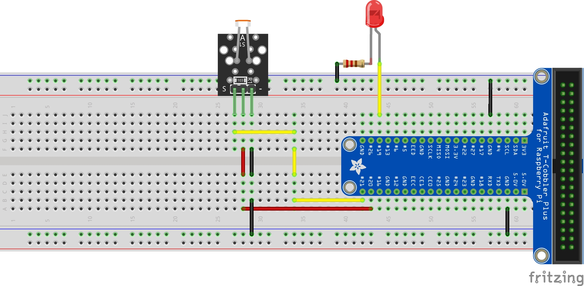
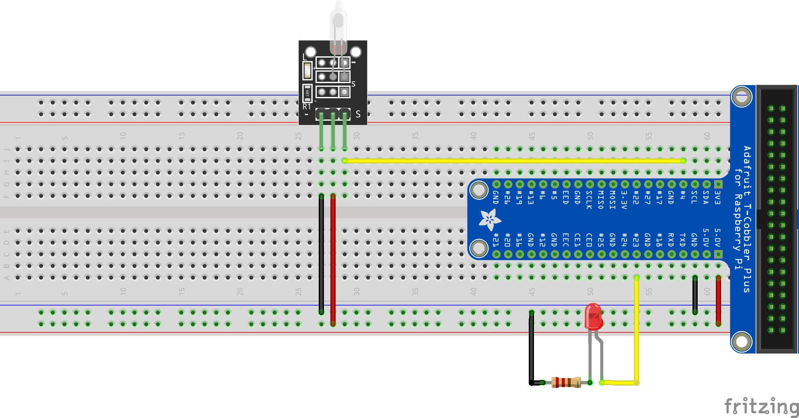
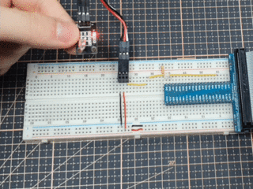
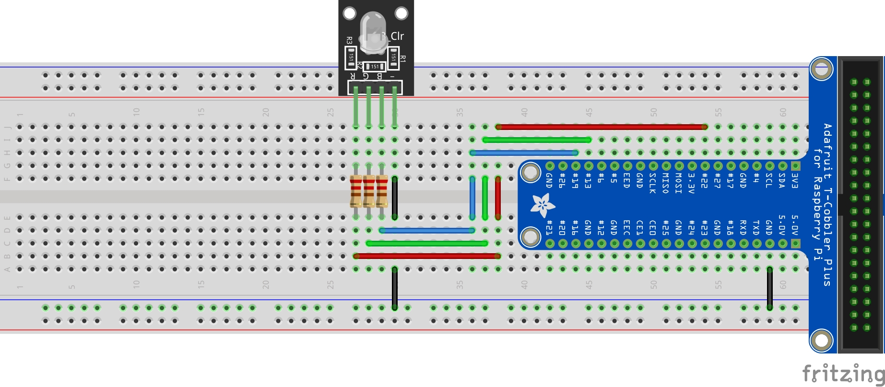
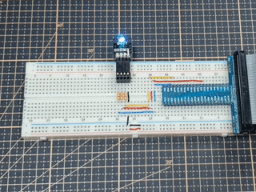
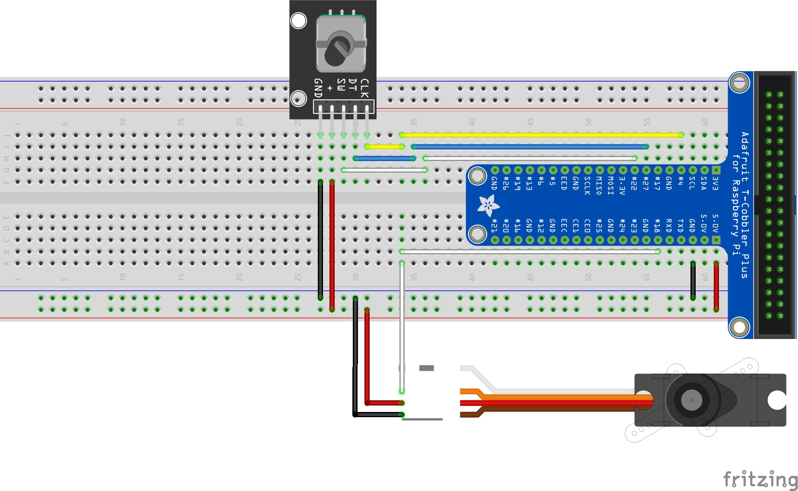
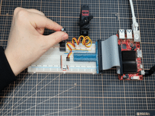

# sensors

### info
- A project to try different sensors on the SBC.
- [Go to Wiki](https://wiki.odroid.com/common/application_note/arduino_sensor_kit/start)

### requirements
- target board: odroid-c4, odroid-n2l
- kernel: 4.9.y
- [odroid-wiringpi](https://github.com/hardkernel/wiringPi) (>= 3.14.5)
```
$ sudo apt install software-properties-common
$ sudo add-apt-repository ppa:hardkernel/ppa
$ sudo apt update
$ sudo apt install odroid-wiringpi libwiringpi-dev
$ git clone https://github.com/how2flow/sensors
```

### examlples

* * *

- adc (Photo resistor / KY-018)



```
$ cd sensors/kit/src/analog
$ gcc -o analog-input analog-input.c $(pkg-config --cflags --libs libwiringpi2)
$ ./analog-input
```

* * *

- gpio (Tilt switch / KY-017)



```
$ cd sensors/kit/src/gpio
$ gcc -o gpio-input gpio-input.c $(pkg-config --cflags --libs libwiringpi2)
$ ./gpio-input
```

* * *

- pwm (RGB led / KY-016)



```
$ cd sensors/kit/src/pwm
$ gcc -o pwm-3ch pwm-3ch.c $(pkg-config --cflags --libs libwiringpi2)
$ ./pwm-3ch
```

* * *

- gpio & pwm (Rotary encoder / KY-040)



```
$ cd sensors/kit/src/gpio
$ gcc -o gpio-encoder gpio-encoder.c $(pkg-config --cflags --libs libwiringpi2)
$ ./gpio-encoder
```

* * *

### contact
<a href="mailto:how2soft@gmail.com" target="_blank"></a>
<a href="https://www.youtube.com/channel/UCSixYoVCS1dKRO-FqlBXAiQ" target="_blank"></a>
